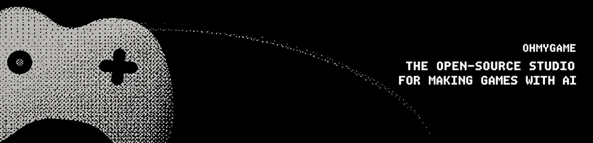
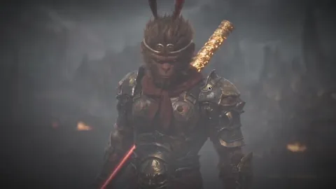
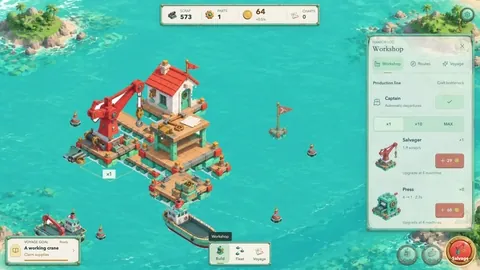
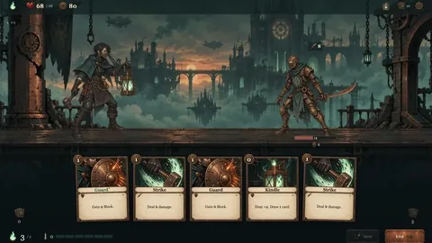

<div align="center">



**Your own one-person game studio.** Everything you need to make games with AI, in one app. Bring your own key.

<p>
  <a href="https://ohmygame.ai/download/mac"></a>
  <a href="https://ohmygame.ai/download/windows"></a>
</p>

<p>
  <a href="#how-its-built"></a>
  <a href="#any-model-your-keys"></a>
  <a href="LICENSE"></a>
  <a href="https://discord.gg/TkrgvGQ2Zc"></a>
</p>

https://github.com/user-attachments/assets/4d5805fe-92a2-40b4-a232-c7452f9a796a

</div>

> [!NOTE]
> 🚧 OhMyGame is in beta. Expect rough edges. Join us and let's build it together!

## What it is

Making a game takes design docs, 2D art, 3D models, video, code, and somewhere
to put it when it's done. Today those live in five or six different tools.
OhMyGame puts them in one app: describe your game, and the agent designs it,
makes the assets, builds it, plays it to check it works, and publishes it to a
link you can share.

Two core design ideas shape it:

1. **Everything lives on a canvas.** Design docs, concept art, 3D models, and
   video sit side by side on one board. One character sketch can grow into more
   art, a video, or a rigged 3D model, and everything is ready to use in your
   game.
2. **The agent does the work.** It drives the canvas the way you would:
   drafting the design doc, turning a character sketch into a rigged 3D model,
   writing the code, and playtesting the result.

It's open source and works with 40+ model providers through Pi, from Anthropic
and OpenAI to DeepSeek and Qwen. Your keys stay on your machine, there are no
per-run credits, and what you make is yours.

## Features

### 🤖 Agent: drives the canvas, builds and plays the game

The agent works the canvas the way you would: it drafts the design doc, lays
out boards, and generates assets on them. Then it reads the design doc, writes
the code, and runs the game in a live preview. Then it opens the game in a window you can watch and plays it, including
real-time canvas and WebGL games. When it finds a problem, it tries a fix and
plays again. Along the way it can generate images, video, and 3D models, search
the web, and use MCP servers or the Codex and Claude Code plugins you already
have.

<!-- Playtesting is open loop for now: the agent plans a batch of inputs, runs
them, then looks at the result. It has no real-time reflexes yet. -->

**▶ The agent playtesting a new item feature on desktop and mobile, then reporting
what it found (sped up 4×).**

https://github.com/user-attachments/assets/3cb982e8-a4a8-4715-bf3c-df4e41e7855b

### 🎨 Canvas: design docs, art, video, and 3D on one board

Every game project has a design space: a main design doc plus boards where
the doc, images, video, and 3D models sit side by side. Nodes can use each
other as references, so one character design can lead to more images, a video,
or a rigged and animated 3D model. Results go into a shared Asset Library that
your games can use.

https://github.com/user-attachments/assets/5a35964d-87b3-4153-8b1b-fc6deced5bb3

### 🔗 Publish: one link, playable anywhere

Sign in and publish: OhMyGame builds your game and gives it a link anyone can
play in the browser. Republishing updates the same link. Published games are
listed in the in-app Community, where you can play what others have made.

## What you can make

Three games our team made with OhMyGame:

<table>
  <tr>
    <td width="33%"></td>
    <td width="33%"></td>
    <td width="33%"></td>
  </tr>
  <tr>
    <td align="center">Interactive film</td>
    <td align="center">Island builder</td>
    <td align="center">Deckbuilding roguelike</td>
  </tr>
</table>

### 🎮 Web games

2D and 3D games for the browser, built with Three.js, React Three Fiber, or
Phaser. The project is a normal web project you can open in any editor.

### 🎬 Interactive stories

Interactive films, visual novels, and story games. Each screen is a free web
page with its own images, video, and code: a main menu, a case archive, a
dialogue, a puzzle. You connect them on a graph, and the runtime handles state,
saves, and navigation. The architecture and authoring model are documented in
[Playable Nodes](docs/playable-nodes/README.md).

<!-- TODO(asset): screenshot or GIF, Node Graph with two finished screens,
made with OhMyGame. Leave out until there is a real one. -->

## How it's built

The idea that holds this together: one agent drives every part of the studio.

**1 · A full Pi agent with a GUI.** OhMyGame runs
[Pi](https://www.npmjs.com/package/@earendil-works/pi-coding-agent) with its
full toolset and persistent sessions, in a GUI built for watching results
rather than reading diffs. Close the app, come back, and the project,
conversation, and context are still there. You describe, review, and steer;
editing by hand is always possible, but it is not the main path.

**2 · Every workspace is files.** A web game is a normal web project. A design
doc is Markdown, and boards and the Asset Canvas share one JSON node model. An
interactive story is a node graph on disk. Each comes with an `AGENTS.md` and
JSON schemas, so the agent edits them the same way it edits code, and the
visual editors read and write the same files.

**3 · Games are tool calls.** Playing the game (`game_use`), generating media,
and checking story nodes are ordinary Pi tools, next to its coding tools. That
is why the agent can chain them: draft a design, make the art, write the code,
and play the result in one conversation.

## Any model, your keys

OhMyGame does not lock you into one model or charge per run.

- **Coding models from 40+ providers** through Pi, including Anthropic,
  OpenAI, Google, DeepSeek, Qwen, Kimi, GLM, MiniMax, xAI, Mistral, Groq,
  OpenRouter, Amazon Bedrock, and Vercel AI Gateway.
- **Sign in with a subscription you already have**, such as ChatGPT Plus/Pro or
  GitHub Copilot, or paste an API key.
  <!-- TODO(legal): check each provider's terms before naming more subscriptions -->
- **Media models** for images, video, and 3D through OpenAI, OpenRouter,
  Volcengine Ark / BytePlus ModelArk, and Meshy.

Keys stay in the local daemon. They never reach the agent's workspace, your
game, or the renderer.

## Quick start

### Download

Grab the installer from the buttons at the top or from
[Releases](https://github.com/WhiteTowerAI/ohmygame/releases). Builds are
available for macOS (Apple silicon) and Windows (x64). The Windows build is
not code-signed yet, so Windows may show a SmartScreen warning during install.

### First run

OhMyGame ships without a model. Connect one before your first prompt:

1. **Open Settings → Providers & Models** and connect a provider for the
   agent. Sign in with a subscription you already have, such as ChatGPT
   Plus/Pro or Anthropic, or paste an API key. OpenRouter is the
   quickest start: one key covers language, image, and video models.
2. **Add media providers if you want them.** The agent can design and build a
   game with only a language model. Generating art, video, or 3D needs its own
   provider:

   | To make                       | Connect                                                             |
   | ----------------------------- | ------------------------------------------------------------------- |
   | Design docs, code, playtests  | Any language model provider                                         |
   | Images and sprites            | OpenAI (API key), OpenRouter, or Volcengine Ark / BytePlus ModelArk |
   | Video                         | OpenRouter, or Volcengine Ark / BytePlus ModelArk                   |
   | 3D models, rigging, animation | Meshy                                                               |

   Signing in with ChatGPT does not cover image generation. To use GPT Image,
   connect OpenAI with an API key.

3. **Pick a model and describe your game.** Choose the model in the prompt box
   on the home screen, then describe what you want to make.

Web search works without setup. Sign in under **Account** only when you want
to publish a game; making games locally needs no account.

### Run from source

Requires Bun 1.4.2 or newer for the toolchain and Node.js 22.19+ for the daemon.

```bash
git clone https://github.com/WhiteTowerAI/ohmygame.git
cd ohmygame
bun install --frozen-lockfile
bun run dev            # web renderer + local daemon
# or
bun run dev:desktop    # Electron app
```

See [CONTRIBUTING.md](CONTRIBUTING.md#configuration) for configuration.

Design and Asset Canvas share boards, Markdown documents, and local media
under `canvas/`. See [Canvas workspace](docs/canvas-agent.md) for the file
contract and offline migration instructions.

## Privacy

Your projects and keys stay on your machine. Prompts and generation requests go
directly to the model providers you choose. Publishing requires an OhMyGame
account and uploads only your game's static build. Release builds check for
updates and send anonymous usage events (PostHog, no session recording) and
crash reports (Sentry, no personal data). Builds from source send no telemetry.

## Roadmap

We're working on first-run setup, plain-language playtest reports, remixing
games from the Community, and Intel Mac / Linux builds. See
[Issues](https://github.com/WhiteTowerAI/ohmygame/issues) for what's next, and
vote with 👍 on what matters to you. Want to help? Look for
[`help wanted`](https://github.com/WhiteTowerAI/ohmygame/labels/help%20wanted)
issues.

## Contributing

Issues and PRs are welcome. See [CONTRIBUTING.md](CONTRIBUTING.md) for setup,
checks, and PR conventions, and [SECURITY.md](SECURITY.md) for reporting
security issues.

## License

[Apache-2.0](LICENSE). The OhMyGame name and logo are not covered by the
license.
