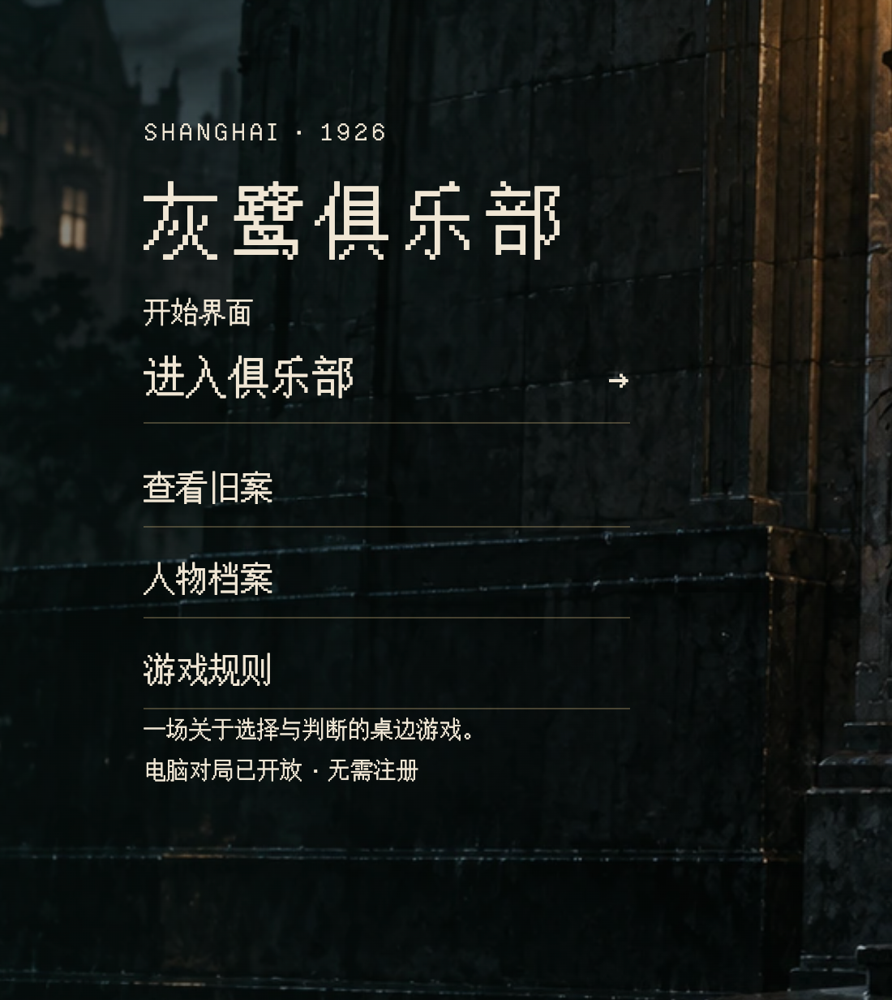
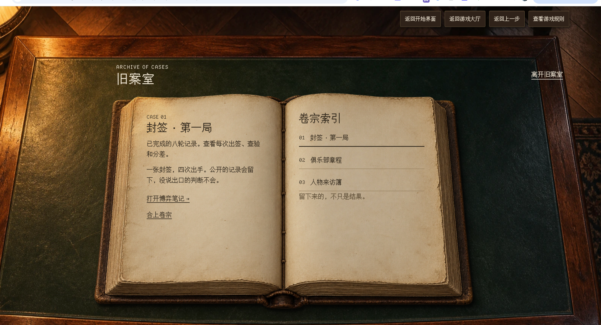

# Vision

## The problem: we decided what a screen can be

The current Interactive Drama editor offers a fixed set of node types: Start,
Open UI, Scene, Interaction, Choice, Ending, Story Map, Settings, Condition,
and Update State. Each type has its own form, its own rules, and its own
player surface.

That design made common things quick, but it also decided in advance what a
screen is allowed to be. As soon as an author wants something the categories
did not anticipate, the tool stops helping.

Two screens from the Ash Club (灰鹭俱乐部) prototype started this redesign.

### Case 1: a main menu with its own identity

This is not a "menu type". It is a designed page: a period title in a pixel
typeface, a subtitle, four entries with their own rules and arrow, a short
description, and a dark architectural background. The author wants to decide
the typography, layout, and how each entry reacts, and wants each entry to
lead somewhere different.

A fixed Open UI node can approximate a list of buttons. It cannot let the
author invent the screen.

### Case 2: an archive you can actually handle

The case archive is an open book on a desk. The right page is an index of
cases; choosing one changes the left page. The left page shows a record that
depends on what the player has done ("已完成的八轮记录"), and offers "打开博弈笔记"
to go deeper. Across the top, a persistent bar lets the player return to the
start screen or the lobby, go back one step, or read the rules.

This screen mixes several things the old model splits into separate types:
page changes inside one screen, content that depends on progress, an exit to
another screen, and navigation that exists on every screen. Building it with
fixed categories means either splitting one natural screen into several
nodes or giving up on the interaction.

### What the cases have in common

In both cases the author is not asking for a new node type. They are asking
for **the freedom of a web page**, combined with project media, and a clear
way to say **where the player can go next**.

## The idea: every node is a free screen

Every node is the same kind of thing: project media plus web code, presented
in whatever way is most natural for that screen.

- A node may be a single looping video, a designed menu, a book you can page
  through, a board of clues, a timed choice, or a small game.
- Inside a node, anything a browser can do is allowed: layout, animation,
  video, Canvas, WebGL, internal pages, and interaction.
- A node reports outcomes as named **Signals** such as `open-archive`. It does
  not know which node comes next.
- The **Node Graph** connects each Signal to a target node. The graph shows
  every way the player can move through the project.

In practice each node is like a small web game. The important difference is
that it is **hosted**, not standalone.

## Why hosted nodes instead of one big web game

An author could ask the Agent to build the whole experience as one web game.
Splitting it into hosted nodes is better for this product because:

1. **The flow stays visible.** The graph answers "how can the player get
   here?" without reading code.
2. **The Agent works on a small, precise context.** Changing the archive
   touches the archive, not the main menu. Smaller context produces better
   results and fewer accidental regressions.
3. **Work can be incremental.** Authors can connect a rough flow first and
   then polish one screen at a time.
4. **Infrastructure is shared.** State, saving, back navigation, playtesting,
   and publishing are provided once by the Runtime instead of being rebuilt
   for every project.

The boundary that makes this work:

> Inside a node, presentation and interaction are free.
> Between nodes, state, navigation, saves, and assets are explicit and owned
> by the Runtime.

## The two cases in the new model

**Main menu.** One node. Its background is a declared image asset; its layout
and typography are its own HTML and CSS. It declares four Signals:
`enter-club`, `open-archive`, `open-characters`, and `open-rules`. On the
canvas the node shows four output ports, each connected to a target.

**Case archive.** One node. Paging between cases is internal behavior of the
node, so it needs no extra nodes. The record text reads Project State, such
as completed rounds. "打开博弈笔记" emits a Signal that the graph connects to the
notes node. The top bar is a shared component the archive imports, the same
one other screens import: the archive declares its Signals (`home`, `lobby`,
`rules`) as its own and the graph connects them like any others.

Nothing in either case requires a special node type.

## Keeping freedom accessible

The target authors (see the PRD) range from no coding experience to some.
Freedom must not mean "write code".

- **Agent first.** The author describes a screen and its behavior; the Agent
  writes the node; the author sees it live and keeps refining through
  conversation. Hand editing code is an escape hatch that most authors never
  use.
- **Presets as a starting point.** Choosing "Main menu" or "Cinematic scene"
  gives the Agent and the author a working start. After creation it is an
  ordinary node that can become anything.
- **Project Style.** A shared theme and shared components keep every node in
  one visual language, the way the two Ash Club screens clearly belong to the
  same game. The Agent uses the Project Style for every node it builds.

## Costs we accept, and how we answer them

| Cost of freedom                                        | Answer                                                                                                     |
| ------------------------------------------------------ | ---------------------------------------------------------------------------------------------------------- |
| A blank node is hard to start                          | Presets, Project Style, and describing the screen to the Agent                                             |
| Small changes (one line of text) feel heavy            | Edit text in place in the preview; pick or draw on the preview and ask                                     |
| Branching logic lives in node code, not in the graph   | Each outcome is its own Exit with a one-line condition; Variables are listed read-only in Project          |
| Quality depends on the Agent                           | A small, stable Node contract, project rules for the Agent, validation, and Playtest feedback it can read |
| Screens can drift apart visually                       | Project Style and shared components                                                                        |

## What this is not

- **Not a general game engine.** Large real-time games belong in the Web Game
  workflow. A node may contain a small game, but the product is about
  connected screens.
- **Not a code IDE.** Source is ordinary and inspectable, but the editor is
  built around preview, conversation, and the graph.
- **Not an asset generator.** Media is created in Asset Canvas and referenced
  here by stable Asset ID.

## What success looks like

The redesign succeeds when an author, working mainly through conversation,
can build and publish the following with one node type and no special cases:

- the Ash Club main menu and case archive shown above;
- a cinematic scene that advances when its video ends;
- a branching choice whose options depend on Project State;
- a puzzle that records its result in Project State;
- a toolbar on many screens, implemented once as a shared component;
- push and back navigation;
- a new game and a restored save;
- two nodes that share the same style and components.

If any of these requires a new node category, the model has failed.
