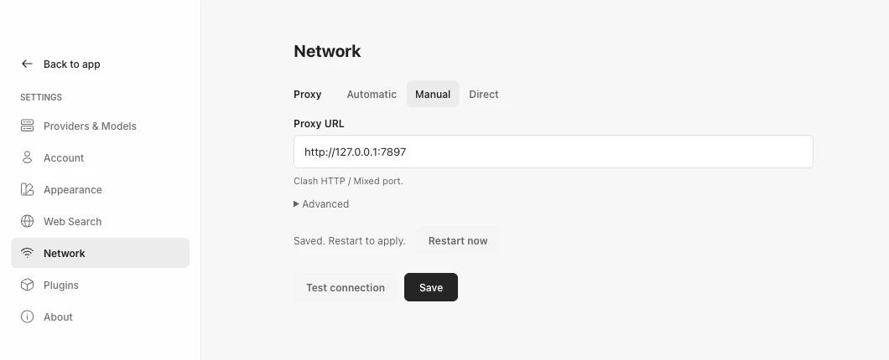

# Runtime

```text
┌──────────── Desktop app / web renderer ─────────────┐
│  Conversation            │  Live preview / watch    │
└──────────────┬──────────────────────────────────────┘
               │ local HTTP + SSE (127.0.0.1)
┌──────────────┴──────── Local daemon ────────────────┐
│  Pi agent · playtest · Asset Canvas · plugins · MCP │
│  project workspaces · preview dev server            │
└──────────────┬──────────────────────────────────────┘
               │ Publish (static build only)
┌──────────────┴──────── OhMyGame Cloud ──────────────┐
│  immutable deployments · Community                  │
└─────────────────────────────────────────────────────┘
```

Everything except publishing runs locally. The code is the source of truth for
the HTTP API and event names; this document covers the parts that are not
obvious from it.

## Processes

`bun run dev` starts the React renderer on `http://127.0.0.1:43120` and the
Fastify daemon on `http://127.0.0.1:43110`. Vite proxies the renderer's `/api`
requests to the daemon.

`bun run dev:desktop` starts Vite and Electron. Electron starts the compiled
daemon itself on an available loopback port, waits for `/health`, and passes
the daemon address plus a random process-scoped token through the isolated
preload bridge. The renderer has no Node.js access.

Bun 1.4.2 installs dependencies and executes builds, tests, and most preparation
scripts. Pinned Plugin archives use Node to preserve their locked ZIP checksums;
desktop runtime preparation uses Node and its built-in environment-file loader.
Standalone daemon development and `bun run start` use Node.js 22.19+
explicitly; desktop development and packaged apps run the daemon with
Electron's embedded Node.js. Desktop packages retain the checksum-pinned
Node.js 22.19.0/npm distribution for workspace commands and MCP servers.
New workspaces still default to npm, and existing package-manager choices remain
authoritative. Prepared examples retain their npm lockfiles.

Build and test commands select Bun explicitly. `bunfig.toml` disables automatic
dotenv loading, automatic peer installation, and global Node-to-Bun substitution,
so a daemon's `node` command runs the real Node executable. Runtime preparation
loads `.env.local` while preserving values supplied by the parent process.
`bun run test:node-runtime` builds the daemon and checks startup and its
authenticated API with Node. `PI_CODING_AGENT_DIR` can isolate the desktop
agent's configuration during verification.

The full Bun daemon experiment remains on `chore/bun-runtime`; the adopted
toolchain stage is on `chore/bun-toolchain`. See the
[adoption report](experiments/bun-toolchain-2026-10-07.md) for validation and
measured tradeoffs, including corrections to the earlier experiment's baseline.

Electron main owns only desktop lifecycle. Projects, conversations, previews,
and events live in the daemon. Closing the last window quits the application
and gives the daemon time to stop active Pi and preview processes.

The renderer receives a small runtime event stream over SSE rather than Pi's
internal event objects. Reconnects replay recent events, and conversations are
restored from Pi's session files, so a reload does not lose or duplicate turns.

## Network proxy

**Settings → Network** configures the application's network connection. Pi's
agent sessions and model requests run in the local daemon, so proxying only the
renderer would not cover the agent.



- **Automatic** uses `HTTP_PROXY` / `HTTPS_PROXY` (including lowercase variants)
  first, then a system HTTP/HTTPS proxy detected by Electron, then a direct
  connection. Both desktop development and packaged apps detect the system
  proxy. Browser-only development uses environment variables.
- **Manual proxy** uses one HTTP/HTTPS proxy URL for both request schemes. For
  Clash, enter its HTTP or Mixed port, such as `http://127.0.0.1:7890`.
- **Direct** clears inherited application proxy variables. System TUN and VPN
  routing still apply.

Settings are stored in `network-settings.json` under the daemon data directory.
Saving or detecting a new proxy does not change active connections. When the
effective proxy URLs or bypass list change, restart the desktop app (or the
standalone daemon) to apply them. Changing an inactive proxy draft or selecting
another mode with the same effective route does not require a restart.
The desktop panel offers
**Restart now**, which stops the daemon and relaunches the app. A full restart
also refreshes existing MCP child-process environments and long-lived network
connections; changing only the fetch dispatcher would not cover them. Environment
files load before proxy initialization, with parent variables taking precedence.

The daemon fetch dispatcher, Electron sessions (including account requests and
the updater), and new tool/MCP child-process environments share the startup
policy. Tools such as Python and npm must still support the proxy variables
they inherit. `localhost`, `.localhost`, `127.0.0.1`, and IPv6 `::1` always bypass
the proxy; advanced settings add more hosts. Automatic mode also preserves
inherited `NO_PROXY` exclusions. Proxy credentials supplied through environment
variables stay in the host processes and are removed from settings/diagnostics
returned to the renderer.

**Test connection** tests the current form, including unsaved settings, through
an isolated connection. It makes a bounded HTTPS HEAD request to
`https://api.openai.com/v1/models` without model credentials or redirects. An
HTTP response, including 401 or 403, confirms transport reachability, not model
access or successful inference. It neither saves the draft nor changes the
global dispatcher or the next-startup configuration. Automatic tests refresh
system detection only for the test when no environment proxy is set.
**Detect system proxy** asks Electron over private
child-process IPC and leaves the active connection unchanged.

This first version accepts HTTP/HTTPS proxies. Manual SOCKS proxies, proxy
authentication fields, and `ALL_PROXY` are not supported. System detection
selects the first supported route for `https://api.openai.com` at startup; it
does not reproduce PAC rules for each destination or retry a PAC fallback list.
Use a fixed HTTP/Mixed proxy or TUN when destination-specific PAC rules are
required. Model **Base URL** fields describe API service/relay endpoints and
must not contain a Clash forward-proxy address.

## Trust boundary

Pi runs in trusted-local mode. The workspace is Pi's working directory, but
`cwd` is not an operating-system security boundary, and enabled Pi tools run
without an OhMyGame approval prompt. Provider credentials stay in the daemon
and are never written to workspaces or returned to the renderer.

The desktop app writes the daemon's access token to the daemon's stdin, not
to its environment, which other processes of the same user can read. A daemon
started on its own may be given the token in `OHMYGAME_DAEMON_TOKEN`; it
removes the variable at startup. Either way no process the daemon starts
inherits the token: preview servers, dependency installs, publish builds, the
Agent's shell, stdio MCP servers, and Git. Project processes also run without
the daemon's other settings (`OHMYGAME_*`, `DAEMON_HOST`, `DAEMON_PORT`).

## Agent game use

General Game projects start as engine-independent workspaces with Code,
Design, and Assets. The bundled Game Studio plugin provides game production,
architecture, and verification Skills for General Game, Godot, and Interactive
Story projects. Web Game keeps its independent Web Game Studio plugin and
existing creation instructions. Plugins are enabled by default; a saved disabled
setting is respected when creating a project or agent session. Compatible
Skills are listed for the agent, which reads the relevant ones for its task.

General Game's **Web preview** switch in **Project settings** is off by default.
The user controls this capability; adding a dev script does not enable it.
Enabling it exposes Preview, Play, and the available Web `game_use` tool. It can
be enabled before browser output exists; the preview starts when the configured
startup script becomes runnable. Disabling it stops the preview server and returns
the workspace to Code if Preview was selected. The switch survives reload and
duplication. Web Game keeps its existing preview behavior.

Web publishing is independent of the switch: it validates a static `index.html`
or the configured build's static output. Native engines use their own tools or
Connections; General Game does not install an engine or initialize a Web wrapper.

Web Game's **Play** button opens one human-controlled game window per project.
Repeated clicks focus the existing game without reloading it. While that window
is opening or running, the editor unloads its Preview iframe and shows the last
project cover with a **Return to game** action. Closing the player restores the
iframe when the Preview tab is visible; other tabs do not start another game.
Opening or returning to the player reloads neither a ready development server
nor an in-flight server startup. Browser-only development uses a named popup.

The human window uses the Preview's browser storage and receives no editor
preload or daemon credentials. Moving between the iframe and player reloads
the game, so in-memory progress is not transferred; saved progress depends on
the game's storage. Reload targets the active human game. A restarted server
updates an open player to its new origin. Human play and agent tests share the
development server and source, so code changes can still hot-update both.

The desktop runtime exposes game interaction and verification as the Pi custom
tool `game_use`. This is an OhMyGame core capability rather than a Plugin:

1. The current Web adapter starts or reuses the project's local Preview and
   accepts only a path, query, or hash on that Preview origin.
2. A private child-process IPC channel forwards typed requests from the daemon
   to Electron main. It is not part of the renderer API.
3. Electron main owns hidden, per-playtest `BrowserWindow` sessions using the
   bundled Chromium runtime.
4. The custom tool returns bounded DOM, canvas, console, failed-request, and
   optional game-state data. PNG captures are returned to the model as image
   content.

The tool supports `open`, `inspect`, `act`, `capture`, and `close`. Runtime
adapters receive a typed open target; the Web adapter uses a Preview URL while
other adapters can use their project or process identity. Actions
cover semantic or coordinate clicks, text input, instant or held key presses,
touch, bounded waits, viewport resizing, and the optional game bridge below.
Calls are sequential, abort with the Agent turn, and time out after 30 seconds.
Sessions are destroyed when explicitly closed, when the daemon or Electron app
shuts down, or after an open failure. At most four sessions may remain open at
once, which bounds hidden-window resource use if an Agent misses cleanup.

The Preview toolbar can reveal the same isolated windows in a watch mode. These
are independent, movable, resizable native windows with the normal macOS title
bar and traffic-light controls. Showing them initially does not take focus, but
they accept normal window interaction after the user clicks them. They do not
stay above unrelated applications. This does not reuse the user Preview or
mirror screenshots: the user sees the exact Chromium surface receiving Agent
input. Closing the watch surface hides it without terminating the playtest
session.

Playtest windows use an isolated partition with sandboxing, context isolation,
and Node integration disabled. Main-frame navigation stays on the original
Preview origin, popups and downloads are blocked, and permissions are denied
except pointer and keyboard lock for game input. Only loopback HTTP Preview
URLs are accepted. This capability is available only when the daemon is owned
by the Electron process; browser-only daemon development does not register the
tool.

This is deliberately a game-use runtime, not unrestricted Browser Use or
desktop Computer Use. It provides the smallest stable surface needed for
repeatable gameplay and visual checks without adding Playwright, Puppeteer, or
a system Chrome dependency to generated games.

### Runtime adapter boundary

`game_use` is backed by a typed runtime adapter. The adapter advertises its
runtime, supported project types, input methods, observations, deterministic
operations, and whether it can be shown in watch mode. The daemon registers
the tool only when the current project's type is included in those capabilities
and, for General Game, its Web preview switch is enabled.

The shipped adapter is `web` for `web-game`, `interactive-story`, and configured
Web previews in `general` projects
and uses Electron's bundled Chromium. Godot and Unity projects do not receive this tool yet. When
their runtime bridges are added, they should implement the same adapter
contract for launch or attach, input, screenshots, state, reset or stepping,
and shutdown. An editor MCP connection alone is not a runtime adapter and
must not be presented as gameplay verification.

### Optional game bridge

Games with random, timed, or deeply nested states may expose a serializable,
test-only bridge while the `ohmygamePlaytest` query parameter is present:

```ts
declare global {
  interface Window {
    __OHMYGAME_PLAYTEST__?: {
      snapshot?: () => unknown | Promise<unknown>;
      reset?: () => void | Promise<void>;
      setSeed?: (seed: number) => void | Promise<void>;
      step?: (milliseconds: number) => void | Promise<void>;
    };
  }
}

export {};
```

`snapshot()` should return compact JSON-serializable simulation state, not
renderer objects or credentials. The other methods should perform one named,
deterministic operation and may be asynchronous. The driver advertises only
methods that exist. Games must remain fully playable without this bridge, and
playtests should still use real input and screenshots to verify what a player
sees. Capture analysis reports opacity and luminance variance as a blank-frame
warning; it is a heuristic rather than a semantic visual assertion.

## Persistence

Each project lives under the daemon data directory:

```text
projects/<project-id>/
├── project.json   project identity and latest publication
├── cover.webp     custom cover; its presence stops automatic replacement
├── cover-auto.webp last automatic cover, retained when a custom cover is applied
├── workspace/     the project files (or an existing folder in the desktop app)
└── session/       Pi session files, one per conversation
```

Removing a project never deletes an existing folder used as its workspace.

Project covers are saved independently of publishing. Selecting an image in the
publish dialog previews it; **Apply cover** saves it and stops automatic cover
replacement. **Restore automatic cover** returns to the last automatic cover,
or an Interactive Story's Scene thumbnail when available. Automatic captures
cannot overwrite a custom cover, including captures already in flight. Existing
covers from older app versions are protected as custom covers until the user
restores automatic mode. Restoring removes the custom cover; the automatic
cover is retained separately. Duplicating a project preserves both covers.
The Community cover is a snapshot in the published Deployment and changes only
when an update is published; publication details show that snapshot.

## Publishing

A workspace is publishable when it has a non-empty `scripts.build` that
produces a static `index.html` under `dist`, `build`, or `out`, or has a root
`index.html`. Only that static output is uploaded; hidden files, dependencies,
and symbolic links are skipped, and binary assets are preserved byte for byte.
The workspace, Pi sessions, conversations, and credentials are never sent.

Each publish creates an immutable Deployment of the same Game, so the play link
stays the same. The project stores only the publication identity: Game ID,
Deployment ID, play URL, publish time, and the published title and description.

The Publish v1 contract is in the
[`ohmygame-cloud` repository](https://github.com/WhiteTowerAI/ohmygame-cloud/blob/main/docs/publish-v1.md).
